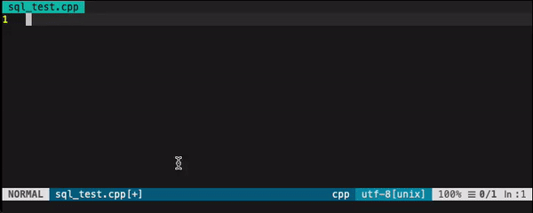

# SQL uppercase Hamal
Brute force SQL uppercase syntax vim plugin

### Installation using vim-plug 

 - Add `Plug 'elvisoric/sql_uppercase_hamal', {'branch':'main'}` to your `~/.vimrc` (or `stdpath('config') . '/init.vim'` for Neovim)
 - Reload .vimrc and call`:PlugInstall` to install plugin.
 - Enjoy

How to use:
Select lines and call `:SqlHamal`

### Example 1

